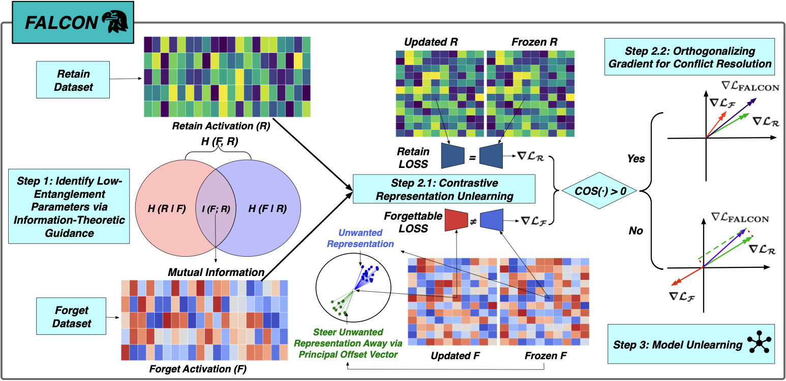

# FALCON: Fine-grained Activation Manipulation by Contrastive Orthogonal Unalignment

[](https://neurips.cc/)
[](https://www.python.org/downloads/)
[](https://pytorch.org/)
[](LICENSE)

Official implementation of **"FALCON: Fine-grained Activation Manipulation by Contrastive Orthogonal Unalignment for Large Language Model"** accepted at **NeurIPS 2025**. The details are available at [📄 Paper](https://arxiv.org/abs/2502.01472).

---

## 🎯 Overview

FALCON is a representation-guided unlearning framework for Large Language Models (LLMs) that addresses the critical challenge of selectively removing undesired knowledge while preserving model utility.

<div align="center">
  
  <p><i>Schematic overview of FALCON. The pipeline comprises three stages: parameter selection based on mutual information (Step 1); contrastive orthogonal unalignment, which consists of
contrastive mechanism on both forgetting and retention datasets (Step 2.1) and orthogonal gradient conflict resolution (Step 2.2); and model unlearning guided by these components (Step 3).</i></p>
</div>

---

## 🚀 Quick Start

### Installation

```bash
# Clone the repository
git clone https://github.com/CharlesJW222/FALCON.git
cd FALCON

# Create conda environment from yaml file
conda env create -f environment.yaml
conda activate falcon

# Install dependencies
pip install -r requirements.txt
```

---

## 🔧 Usage

### Step 1: Mutual Information Analysis

Identify optimal layers for unlearning using information-theoretic guidance:

```bash
# TOFU dataset analysis
python run_MI.py \
    --dataset tofu \
    --model meta-llama/Llama-3.2-1B-Instruct \
    --forget-config forget10 \
    --retain-config retain90 \
    --ratio 1.0 \
    --all-layers

```

### Step 2: Execute Unlearning

## 📖 Interactive Tutorial

We provide a Jupyter notebook for hands-on exploration about unlearning:

```bash
jupyter notebook quick_start.ipynb
```
---

## 📝 Citation

If you find our paper's idea useful in your research, please cite:

```bibtex
@inproceedings{
  hu2025falcon,
  title={{FALCON}: Fine-grained Activation Manipulation by Contrastive Orthogonal Unalignment for Large Language Model},
  author={Jinwei Hu and Zhenglin Huang and Xiangyu Yin and Wenjie Ruan and Guangliang Cheng and Yi Dong and Xiaowei Huang},
  booktitle={The Thirty-ninth Annual Conference on Neural Information Processing Systems},
  year={2025},
  url={https://openreview.net/forum?id=BDKkFwskot}
}
```

---

## ⚠️ Responsible AI Statement

FALCON is designed for responsible AI deployment. While our method enables selective knowledge removal from LLMs, users must ensure:

- Compliance with applicable regulations (e.g., GDPR's "right to be forgotten")
- Ethical considerations in determining what knowledge should be unlearned
- Transparency in communicating model capabilities and limitations
- Ongoing monitoring for unintended consequences

The authors do not endorse using this technology for malicious purposes or circumventing legitimate safety mechanisms.

---

## 🔗 Related Projects and Datasets

- [WMDP: Weapons of Mass Destruction Proxy](https://github.com/centerforaisafety/wmdp)
- [TOFU: Task of Fictitious Unlearning](https://github.com/locuslab/tofu)
- [MUSE: Machine Unlearning Six-Way Evaluation](https://github.com/swj0419/muse_bench)

---

<div align="center">
  <p>⭐ Star us on GitHub if you find FALCON useful!</p>
  <p>Made with ❤️ by the University of Liverpool TACPS Lab</p>
</div>
